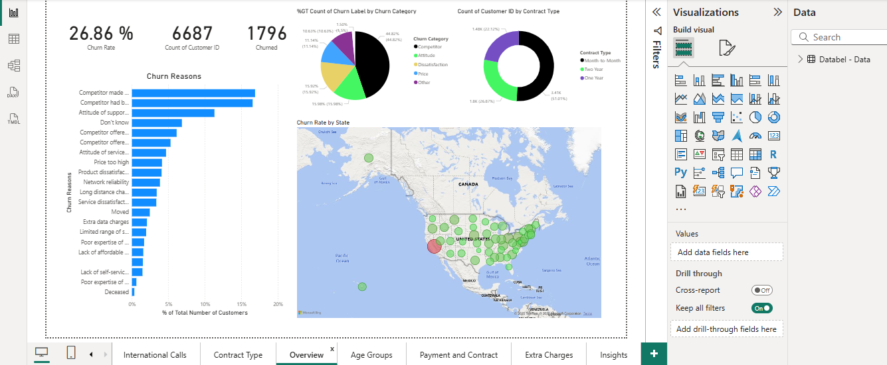
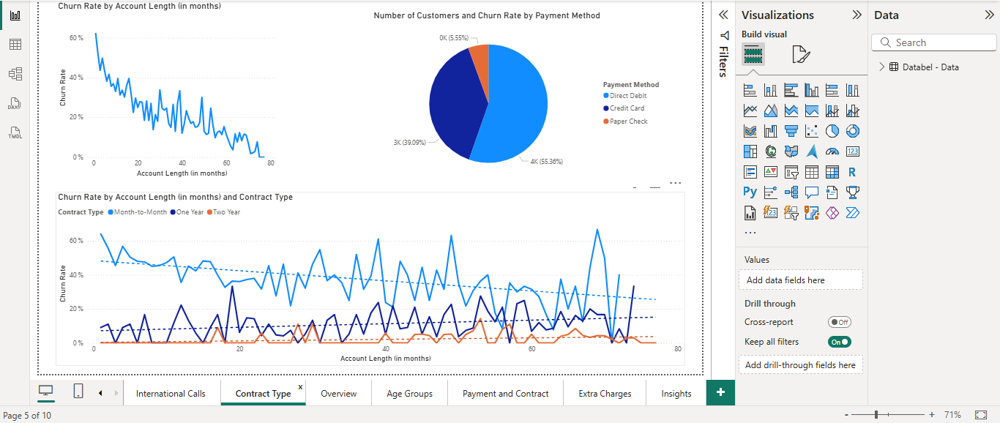
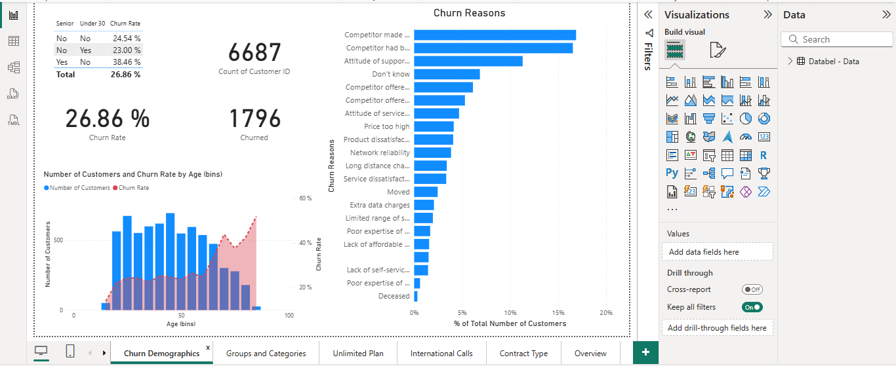
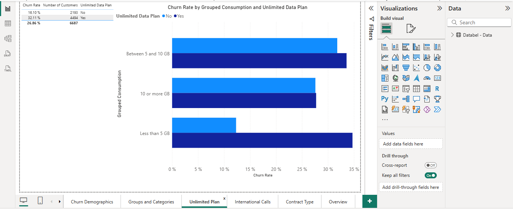
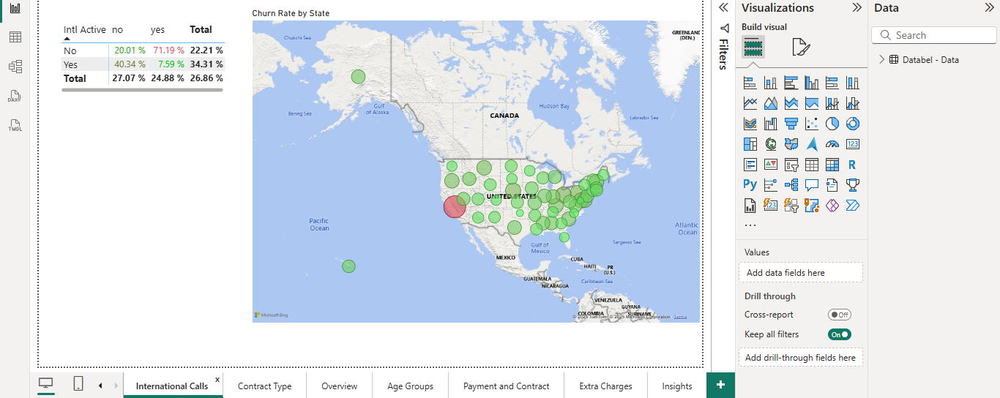

# 📉 Telecom Customer Churn Analysis (Power BI)

## 📊 Project Overview
This Power BI project explores customer churn behavior in a telecommunications company. The dashboard provides insights into **which customers are leaving, why they are leaving, and what factors contribute most to churn**.  

The analysis helps decision-makers identify high-risk customers and design better retention strategies.  

---

## 🛠 Tools & Techniques
- **Power BI Desktop** for dashboard design  
- **Power Query** for data transformation and cleaning  
- **DAX (Data Analysis Expressions)** for custom measures such as churn rate, customer segmentation, and tenure grouping  

---

## 📈 Key Features
- **Churn Overview Page** – KPI cards showing overall churn percentage, active vs. churned customers. churn reasons. churn rate by state. %GT count of churn label by churn category
- **Churn Demographics** – Breakdown of churn by age group. churn reasons. Cards showing overall churn rate and number of churend customers compared to number of all customers.
- **Groups and Categories** – Monthly and yeary churn rates, Breakdown of churn by category, contract type and gender
- **Unlimited Plan** – Churn rate by grouped consumption (eg: less than 5gb or between 5 and 10 gb) and unlimited data plan.  
- **Contract type** – Churn rate by payment method, account length.
- **Insights** – KPI cards showing average and number of customer service calls, AVG extra international charges, AVG Extra data charges.
- **Interactive Filters** – Slicers to explore churn by contract length, payment method, or service bundle

---

## 💡 Insights
- Customers on **month-to-month contracts** are most likely to churn compared to yearly contracts.  
- Most of **Churn reasons** are competitor made better offers or had a better diveces .  
- Customers had **unlimited data plan** and **Consume less than 10 gb** churn more often than those with limited data plan and consume more than 10 gb.  
- Most of churned customer are in the age bin of 65 or higher  

---

## 📸 Dashboard Previews

### Overview Page

### Churn by Contract Type
Customers on month-to-month contracts show the highest churn.

### Churn demographics

### Churn by grouped consumption and unlimited plans

### Churn rate by states
